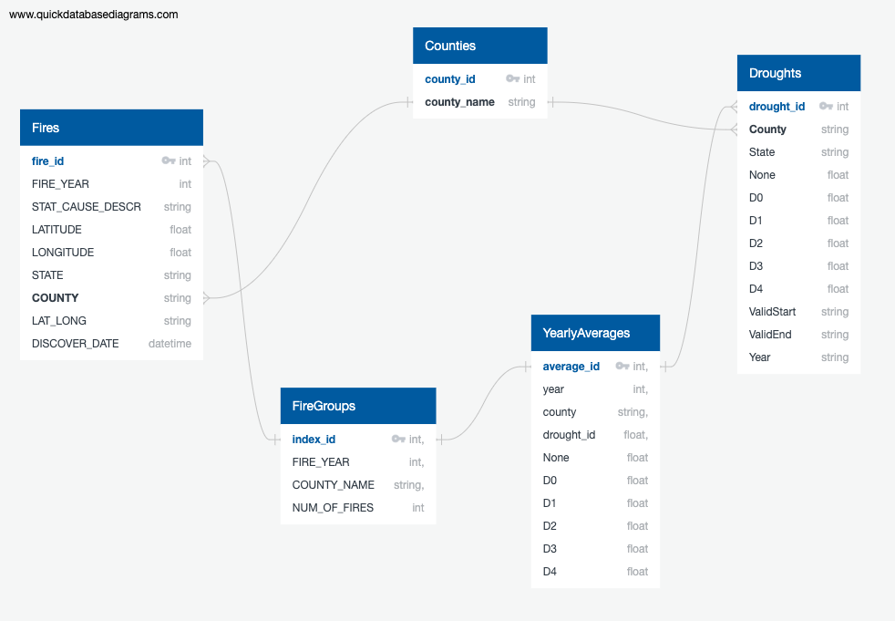

# CA Fires vs Drought ETL Project

Fire Foxes: Enrique Gallego, Rebecca Bland, Jacob Girgle, Seidy Pacheco

## Project Proposal

We aim to prepare data so that future analysts can examin whether there are similarities and correlations between drought data and fire data over a given period of time in California. Are there similarities in specific drought timeframes that set up for strong fire conditions? 

By comparing the data for both droughts and fires over the same period of time we will eventually be able to predict specific drought conditions that are the perfect indicators for a fire to occur.

## Notes and Limitations

* The data selected was chosen for California over the time period of 2014 through 2015
* Data was organized on a per-county basis at the highest level, but also included location information for each fire
* One of the source files for our fire data proved to be too large to be able to process within a reasonable amount of time, so we decided to only prepare data for the 2014 and 2015 years for both fire and drought data

## Extract

**Data Source 1** - [Wildfire Data](https://www.kaggle.com/rtatman/188-million-us-wildfires) accessed through the 1.88 Million US Wildfires dataset on Kaggle, and imported data from a sqlite file. Data was loaded through Jupyter Labs and pulled as a CSV once needed tables were selected. Data includes:
* Fire ID, Fire Name, Fire Year, Discovery Date and Time, Cause Code and Description, State, County, FIPS Code, Latitude, Longitude
* Using sqlalchemy, queried for California fires only listed by County

**Data Source 2** - [Drought Data](https://droughtmonitor.unl.edu/) downloaded data set from the University of Nebraska-Lincoln as a CSV. Data includes:
* Drought ID, County Name, Year, Drought Descriptions (None(no drought), D0(abnormally dry), D1(moderate drought), D2(severe drought), D3(extreme drought), D4(exceptional drought))

**Data Source 3** - [Counties Data](https://en.wikipedia.org/wiki/List_of_counties_in_California) scraped data set from Wikipedia. Data includes:
* County ID, County Name, FIPS Code, Population, Area 

## Transform

**Data Source 1** - [Wildfire Data](https://www.kaggle.com/rtatman/188-million-us-wildfires)
* Using pandas, dropped various unused columns and filtered data for California and between 2014 and 2015
* Combined latitude and longitude to a single string
* Used Lat-Long string with GeoPy to identify counties
* GeoPy took on average 5 seconds to run 10 lines of data, overall to link counties to fire information for approximately 180,000 lines of data took approximately 2 hours
* Exported to CSV for use

**Data Source 2** - [Drought Data](https://droughtmonitor.unl.edu/)
* Using pandas, dropped various unused columns and filtered data for California and between 2014 and 2015
* Exported to CSV for use

**Data Source 3** - [Counties Data](https://en.wikipedia.org/wiki/List_of_counties_in_California)
* Once data was scraped and loaded, dropped several unused columns
* Renamed columns for ease of use and readability
* Added County ID column
* Exported to CSV for use

## Load

**Postgres**
* There are many potential relational relationships between the different tables we created for this dataset. Due to this, we decided to create and load our database within Postgres.
* In addition to loading the database, we created a few views that future analysts may be able to use:
  - *yearly_droughts_county* - Summarizes number of fires per county per year
  - *Fires_by_drought_period* - Goes a step deeper and joins fire incidents with drought data based on the specific drought conditions when that specific fire began
  - *Fire_cause_summary* - A general overview that summarizes the most common causes of fires from 2014-2015
  - *Yearly_fire_drought_join* - Joins the aggregate number of fires per year per county and the average drought percent for each category for the given year
  - *Fires_drought_join* - Joins raw county and drought date by incidence of fire. Every row demonstrates a fire and associated drought conditions when fire began
  - *fire_county_details* - Provides county details for each aggregate count of fires for every county per year, includes population and area details

## ERD

## Use Cases
* Analysis of fire causes per county and correlating with drought conditions
* Analysis of drought conditions by county per year 
* Analysis of fire occurences by location (lat/lon) and drought conditions at given week

